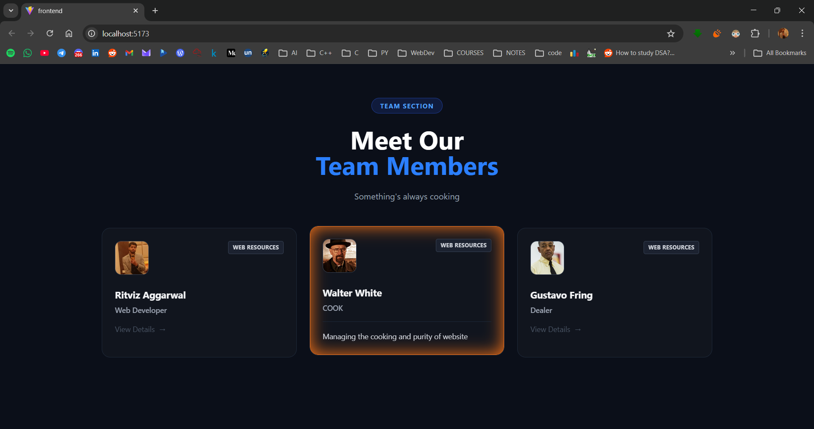
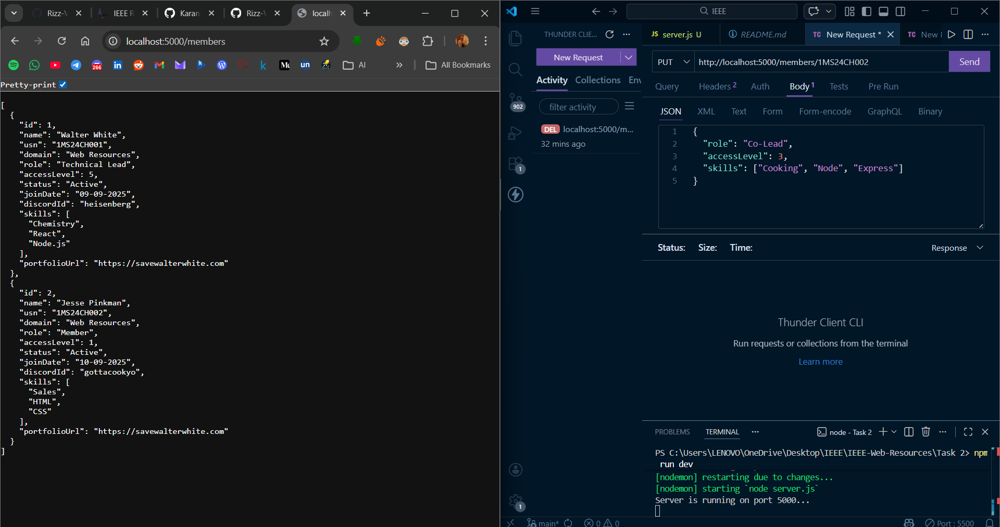
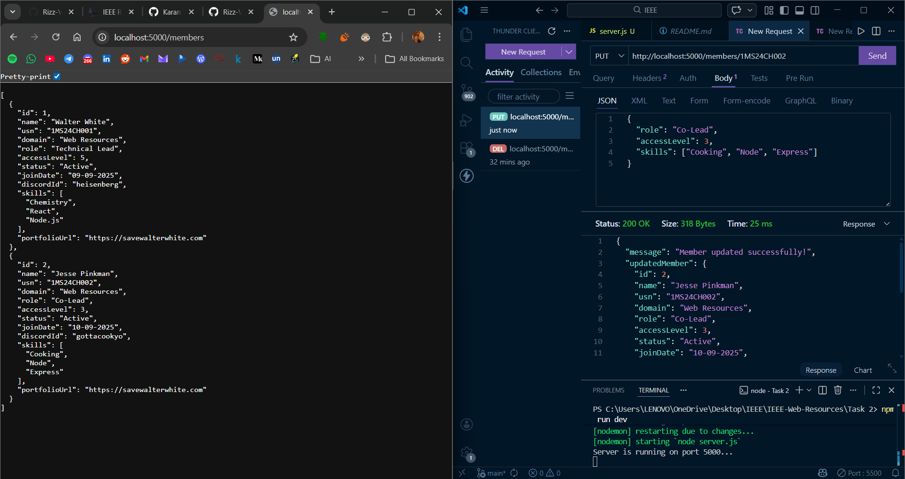

# IEEE Web Resources Recruitment 2026

This repository contains my solutions for the IEEE recruitment tasks. 

---

## 🚀 Tasks Overview

### Task 1: Frontend - "Explore Our Technical Chapters"
Created a clean, modern "Team Section" inspired by the current IEEE RITB website.
* **Tech Stack**: React, Tailwind CSS, and Vite.
* **Work done**: 
    - A reusable `TeamCard` component.
    - Used **CSS Grid** to make the layout perfectly responsive 
    - Added **hover effect** where the card glows and reveals a detailed description of the member's role.
    - Matches the dark theme of the official site.

#### UI Screenshot:

---

### Task 2: Backend Logic - "Membership API"
Developed a simple REST API to manage a list of club members.
* **Tech Stack**: Node.js and Express.
* **Functions**:
    - **GET /members**: Fetches the full list of members.
    - **POST /members**: Adds a new member with 10-character USN validation.
    - **DELETE /members/:usn**: Removes a member from the system.
    - **PUT /members/:usn (Add-on)**: An "Edit" feature that lets admins promote members or update their skills without re-adding them.

#### Attributes:
* **Identification**: Name, USN, and Discord ID.
* **Hierarchy**: Role and Access Level (1 to 5).
* **Technical**: Domain, Skills, and Portfolio URL.
* **Tracking**: Membership Status and Join Date.

#### Access Level Guide:
* **Level 1**: Member
* **Level 2**: Core Committee  
* **Level 3**: Co-Lead
* **Level 4**: Lead
* **Level 5**: Technical Lead

#### Screenshots:
**1. Before Promotion**

**2. After Promotion**

---