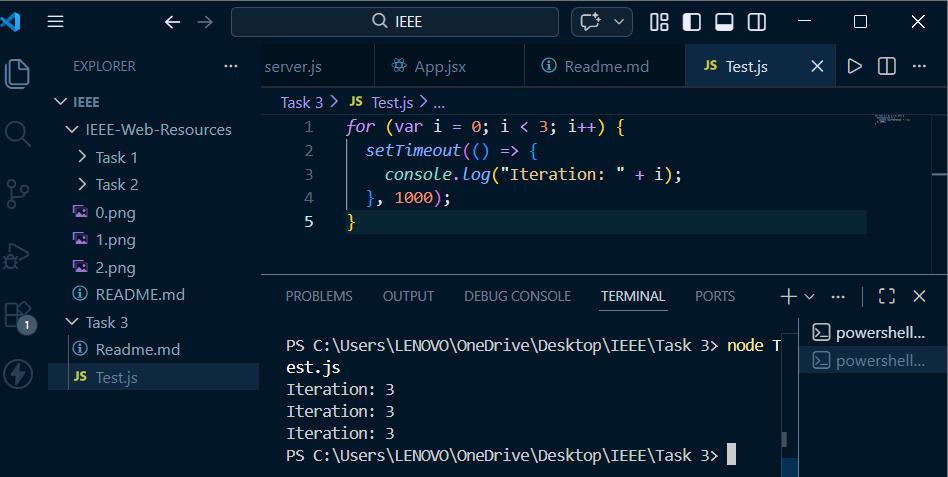

# IEEE Web Resources Recruitment 2026

This repository contains my solutions for the IEEE recruitment tasks. 

---

## 🚀 Tasks Overview

### Task 1: Frontend - "Explore Our Technical Chapters"
Created a clean, modern "Team Section" inspired by the current IEEE RITB website.
* **Tech Stack**: React, Tailwind CSS, and Vite.
* **Work done**: 
    - A reusable `TeamCard` component.
    - Used **CSS Grid** to make the layout perfectly responsive 
    - Added **hover effect** where the card glows and reveals a detailed description of the member's role.
    - Matches the dark theme of the official site.

#### UI Screenshot:


---

### Task 2: Backend Logic - "Membership API"
Developed a simple REST API to manage a list of club members.
* **Tech Stack**: Node.js and Express.
* **Functions**:
    - **GET /members**: Fetches the full list of members.
    - **POST /members**: Adds a new member with 10-character USN validation.
    - **DELETE /members/:usn**: Removes a member from the system.
    - **PUT /members/:usn (Add-on)**: An "Edit" feature that lets admins promote members or update their skills without re-adding them.

#### Attributes:
* **Identification**: Name, USN, and Discord ID.
* **Hierarchy**: Role and Access Level (1 to 5).
* **Technical**: Domain, Skills, and Portfolio URL.
* **Tracking**: Membership Status and Join Date.

#### Screenshots:
**1. Before Promotion**


**2. After Promotion**


### Task 3: Debugging Challenge
---
### Part A:  JavaScript

#### Problem

1. The loop was printing `"Iteration: 3"` three times instead of `0, 1, 2`.  
   The happened because the code used `var`, which doesn’t store a separate value of `i` for each loop iteration. The loop finishes instantly, but `setTimeout` runs after 1 second. By then, `i` is already 3, so it prints `"3"` instead of `0, 1, 2`.


2. The code directly updated `innerText` without checking whether the element with id `"display"` actually exists.  
   If the element is missing in the HTML, the code can crash.

 **Screenshot:**  


---

#### Solution

- Replaced `var` with `let` so each loop iteration keeps its own correct value of `i`.
- Added a safety check before updating the DOM to make sure the `"display"` element exists and avoid runtime errors.

---

#### Corrected Code

```javascript
function Counter() {
  let count = 0;

  const handleIncrement = () => {
    count = count + 1;
    console.log("Count is now: " + count);

    const display = document.getElementById("display");
    if (display) {
      display.innerText = count;
    }
  };

  for (let i = 0; i < 3; i++) {
    setTimeout(() => {
      console.log("Iteration: " + i);
    }, 1000);
  }

  return handleIncrement;
```

### Part B: Express.js API

#### The Problem

1. `fetchUserFromDB` is an async function but it was called without `await`, so it returns a Promise instead of actual user data.
2. There is a typo: `userDate` instead of `userData`.
---

#### Solution

- Added `await` when calling `fetchUserFromDB`.
- Fixed the typo from `userDate` to `userData`.
- Added `return` after the 404 response to stop further execution.

---

#### Corrected Code

```javascript
const express = require('express');
const app = express();

app.get('/user/:id', async (req, res) => {
  try {
    const userData = await fetchUserFromDB(req.params.id);

    if (!userData) {
      return res.status(404).send("User not found");
    }

    res.json({
      status: "success",
      data: userData
    });
  } catch (error) {
    res.status(500).send("Server Error: " + error.message);
  }
});

async function fetchUserFromDB(id) {
  return { id, name: "IEEE Member" };
}
```

---